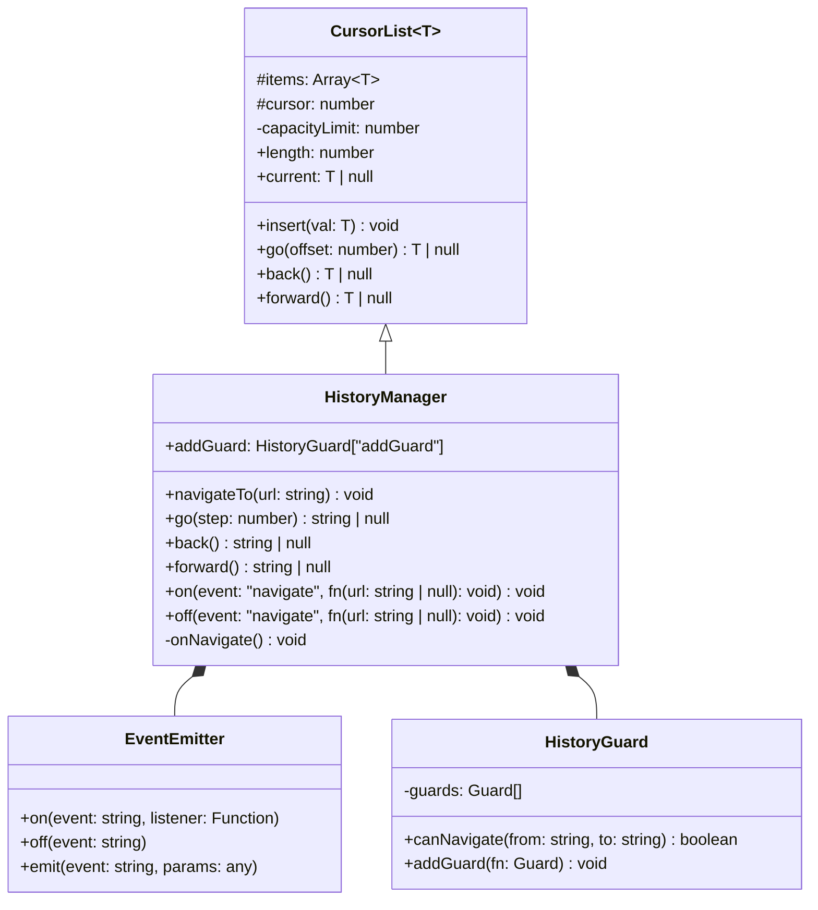

```mermaid
classDiagram
  class CursorList~T~ {
    #items: Array~T~
    #cursor: number
    -capacityLimit: number
    +length: number
    +current: T | null

    +insert(val: T) void
    +go(offset: number) T | null
    +back() T | null
    +forward() T | null
  }

  class HistoryManager {
    +addGuard: HistoryGuard["addGuard"]

    +navigateTo(url: string) void
    +go(step: number) string | null
    +back() string | null
    +forward() string | null

    +on(event: "navigate", fn(url: string | null): void) void
    +off(event: "navigate", fn(url: string | null): void) void

    -onNavigate() void
  }

  class HistoryGuard {
    -guards: Guard[]

    +canNavigate(from: string, to: string) boolean
    +addGuard(fn: Guard) void
  }

  class EventEmitter {
    +on(event: string, listener: Function)
    +off(event: string)
    +emit(event: string, params: any)
  }

  CursorList<|--HistoryManager
  HistoryManager *-- EventEmitter
  HistoryManager *-- HistoryGuard
```
