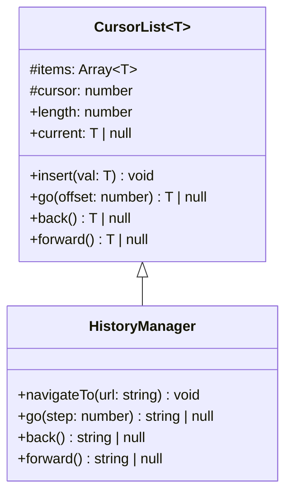

```mermaid
classDiagram
  class CursorList~T~ {
    #items: Array~T~
    #cursor: number
    +length: number
    +current: T | null
    +insert(val: T) void
    +go(offset: number) T | null
    +back() T | null
    +forward() T | null
  }

  class HistoryManager {
    +navigateTo(url: string) void
    +go(step: number) string | null
    +back() string | null
    +forward() string | null
  }

  CursorList<|--HistoryManager
```
